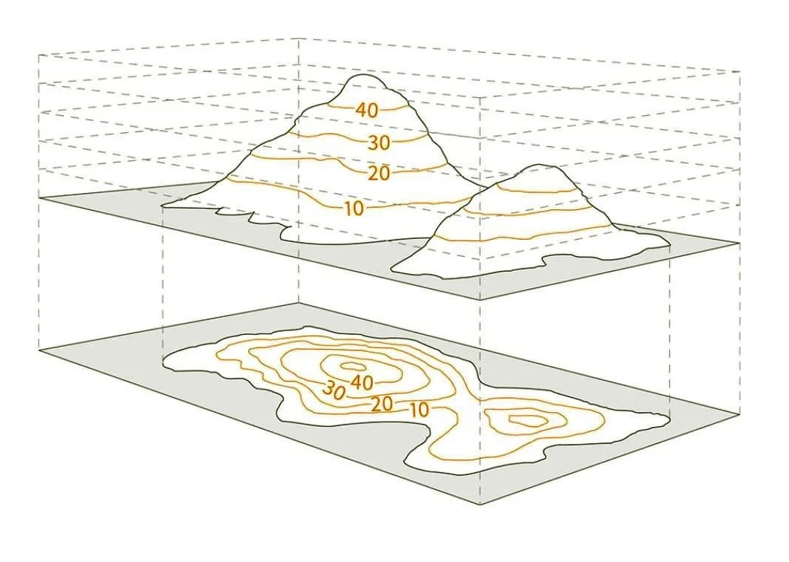
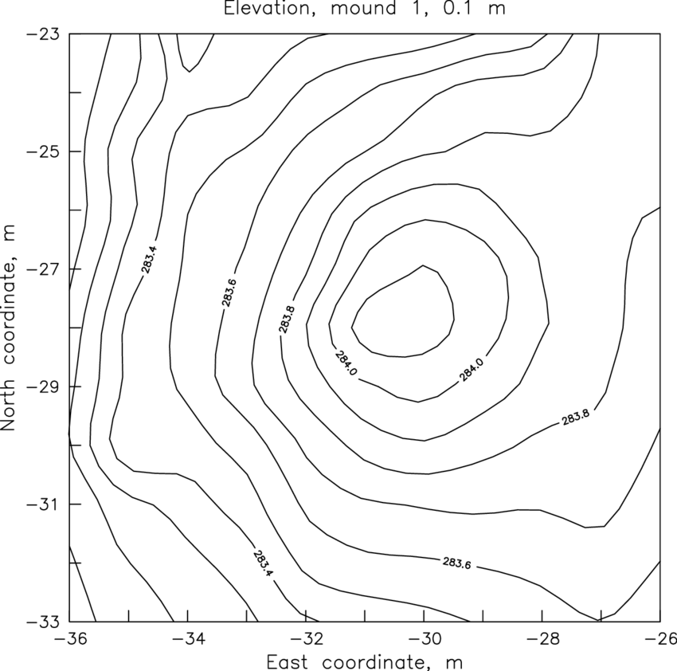

### Track(s) Chosen:
AI in Defense and Disaster Response

### Problem Statement:
**Defense personnel** and **disaster response teams** are often deployed in unfamiliar, high-risk terrains such as **hilly regions**, **dense forests**, or **disaster-hit zones**. In these situations, they lack access to **real-time terrain awareness** and face difficulties in **navigation** and **mission planning**. This increases operational risk, delays response times, and reduces mission efficiency. There is a strong need for a system that can provide accurate **terrain insights**, **intelligent navigation routes**, and **local area information** in real time.

### Proposed Solution:
The **Field Recon Terrain System (FRTS)** helps defense and disaster response **personnel** navigate and understand challenging terrains. Using **satellite imagery** and **elevation data**, we generate detailed **3D models** for interactive exploration. Our system integrates **AI pathfinding algorithms** to find the shortest and safest routes, while providing real-time contextual information like terrain types, hazards, and resources.

What makes our approach unique is the combination of **ground reality terrain modeling** and **AI-driven navigation**, enabling **personnel** to plan movements and access valuable **local intelligence**, such as wildlife habitats, and potential threats. The system works in both **online and offline modes**, ensuring reliability in remote areas.

### Phase 1: Data extraction
Data is extracted in the form of GeoTiff Files, a type of raster image file containing not only image data-such as satellite imagery, aerial photography, or digital elevation models-but also embedded geographic metadata. This metadata enables each pixel in the image to be precisely mapped to real-world spatial coordinates

We extract a specific geographic region from a GeoTIFF elevation file and converts it to a JSON format containing coordinate-elevation pairs with **Spatial Subsetting**, converting **raster pixels** to **JSON format** which aids us in plotting an accurate contour plot of the terrain data.

**Original GeoTiff**
- Spatial subset extraction
- Pixel-to-geocoordinate conversion
- JSON file with structured elevation data_

### Phase 2: Plotting Detailed Terrain 

We load the preprocessed data that we obtained in the previous phase and use it to generate an accurate plot of the ground terrain in as much detail as would allow an accurate and safe navigation for mission critical systems and vehicles.

Additionally we configure visualization and apply responsive layouts to allow interaction and efficient planning.

